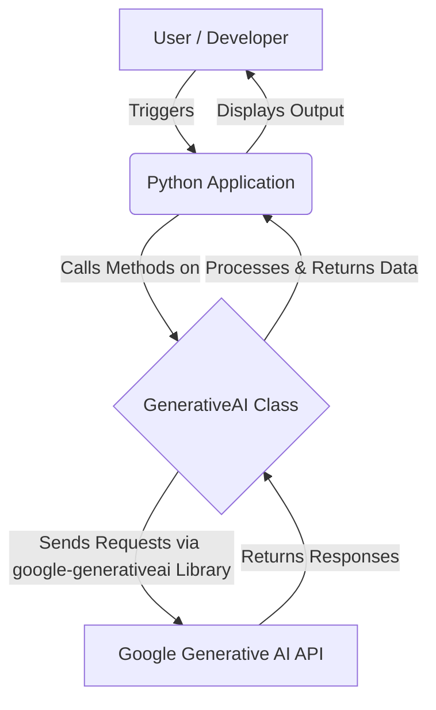

<!--
  Generated by AI-Powered README Generator
  Repository: https://github.com/GDSC-FSC/gdsc-umd-gen-ai-demo
  Generated: 2025-10-07T18:17:33.606Z
  Format: md
  Style: comprehensive
-->

# GDSC UMD Generative AI Demo

**Explore the Power of Google's Generative AI Models with a Simple Python Interface.**

[](https://www.python.org/)
[](https://opensource.org/licenses/MIT)
[](https://github.com/GDSC-FSC/gdsc-umd-gen-ai-demo)
[](https://github.com/GDSC-FSC/gdsc-umd-gen-ai-demo/commits/main)

---

## 📚 Table of Contents
- [📚 Table of Contents](#-table-of-contents)
- [✨ Overview & Introduction](#-overview--introduction)
  - [Purpose & Goals](#purpose--goals)
  - [Why it Matters / Problem it Solves](#why-it-matters--problem-it-solves)
  - [Target Audience](#target-audience)
- [🚀 Feature Highlights](#-feature-highlights)
- [🏗️ Architecture & Design](#️-architecture--design)
  - [High-Level Component Diagram](#high-level-component-diagram)
  - [Core Components](#core-components)
  - [Technology Stack](#technology-stack)
- [▶️ Getting Started](#️-getting-started)
  - [Prerequisites](#prerequisites)
  - [Installation](#installation)
  - [Configuration](#configuration)
  - [Running the Application](#running-the-application)
    - [Development Mode](#development-mode)
- [💡 Usage & Workflows](#-usage--workflows)
  - [Initializing the Generative AI Client](#initializing-the-generative-ai-client)
  - [Listing Available Models](#listing-available-models)
  - [Generating Text from Text Input](#generating-text-from-text-input)
  - [Generating Text from Image & Text Input (Vision)](#generating-text-from-image--text-input-vision)
  - [Engaging in Chat Conversations](#engaging-in-chat-conversations)
  - [Counting Tokens](#counting-tokens)
  - [Working with Embeddings](#working-with-embeddings)
  - [Advanced Content Generation (Safety Settings)](#advanced-content-generation-safety-settings)
  - [Multi-Turn Conversations](#multi-turn-conversations)
  - [Content Generation with Specific Configurations](#content-generation-with-specific-configurations)
- [🚧 Limitations, Known Issues & Future Roadmap](#-limitations-known-issues--future-roadmap)
  - [Current Limitations](#current-limitations)
  - [Known Issues](#known-issues)
  - [Future Roadmap](#future-roadmap)
- [🤝 Contributing & Development Guidelines](#-contributing--development-guidelines)
  - [How to Contribute](#how-to-contribute)
  - [Branching & Pull Request Guidelines](#branching--pull-request-guidelines)
  - [Code Style & Quality](#code-style--quality)
- [📄 License, Credits & Contact](#-license-credits--contact)
  - [License](#license)
  - [Credits & Acknowledgments](#credits--acknowledgments)
  - [Contact](#contact)
- [📖 Appendix](#-appendix)
  - [Changelog](#changelog)
  - [FAQ (Frequently Asked Questions)](#faq-frequently-asked-questions)
  - [Troubleshooting Guide](#troubleshooting-guide)
  - [External Resources](#external-resources)

---

## ✨ Overview & Introduction <a name="overview"></a>

The `GDSC UMD Gen AI Demo` project serves as a practical, hands-on demonstration for interacting with Google's powerful Generative AI models using the `google-generativeai` Python library. It encapsulates various functionalities, from basic text generation to multi-modal input (text and images), conversational AI, and advanced model configurations.

### Purpose & Goals <a name="purpose-goals"></a>
The primary goals of this application are:
1.  **Educate & Demonstrate**: Provide clear, runnable examples of how to integrate and use Google's Generative AI capabilities in a Python application.
2.  **Simplify Experimentation**: Offer a streamlined interface to explore different AI models and their features without extensive boilerplate code.
3.  **Hands-on Learning**: Serve as a foundational codebase for students and developers to build upon and experiment with Generative AI concepts.

### Why it Matters / Problem it Solves <a name="why-it-matters"></a>
Getting started with large language models and multi-modal AI can sometimes feel daunting. This project aims to:
*   **Reduce Entry Barrier**: Simplify the initial setup and interaction with Google's Generative AI API.
*   **Provide Practical Examples**: Show concrete use cases for text generation, image captioning, chat bots, and embeddings.
*   **Accelerate Learning**: Offer a readily available, executable codebase for rapid prototyping and understanding.

### Target Audience <a name="target-audience"></a>
This demo is ideal for:
*   **Students & Beginners**: Those new to Generative AI or the Google Generative AI ecosystem.
*   **Developers**: Looking for quick examples to integrate AI into their Python applications.
*   **Researchers & Enthusiasts**: Interested in understanding the capabilities of Google's latest AI models.
*   **GDSC Members**: As a foundational project for workshops and learning sessions on AI.

[⬆️ Back to Top](#-table-of-contents)

---

## 🚀 Feature Highlights <a name="features"></a>

This application provides a robust set of features for interacting with Google's Generative AI models:

*   ✅ **Model Management**:
    *   Easily list all available Generative AI models and their capabilities.
*   📝 **Text Generation**:
    *   Generate human-like text responses from text-based prompts using models like `gemini-pro`.
*   🖼️ **Multi-modal Input (Vision)**:
    *   Generate descriptive text and insights from a combination of image and text inputs using vision models (`gemini-pro-vision`).
*   💬 **Conversational AI**:
    *   Initiate and manage multi-turn chat conversations with persistent history.
*   🔢 **Token Counting**:
    *   Accurately count tokens for a given text input, useful for understanding model limits and costs.
*   🔗 **Content Embeddings**:
    *   Generate numerical vector representations (embeddings) of text for semantic search, recommendation, and more.
*   ⚙️ **Advanced Generation Control**:
    *   Apply custom safety settings to moderate content generation.
    *   Configure generation parameters like `temperature`, `max_output_tokens`, and `stop_sequences` for fine-grained control.
*   🔄 **Multi-Turn Content Generation**:
    *   Handle complex conversational structures by passing a list of messages for context.

> 💡 **Tip**: Each feature is implemented as a method within the `GenerativeAI` class, making it modular and easy to extend.

[⬆️ Back to Top](#-table-of-contents)

---

## 🏗️ Architecture & Design <a name="architecture"></a>

The application is designed to be straightforward and modular, focusing on clear separation of concerns for interacting with the Google Generative AI API.

### High-Level Component Diagram <a name="component-diagram"></a>


*Figure 1: High-level overview of the application's interaction with the Google Generative AI API.*

### Core Components <a name="core-components"></a>

The application primarily revolves around a single Python class and a main execution function:

*   **`GenerativeAI` Class (`main.py`)**:
    *   This class acts as a wrapper for the `google-generativeai` library.
    *   It centralizes all interactions with the Generative AI models, providing a clean API for different functionalities (text generation, vision, chat, embeddings, etc.).
    *   Initializes the API client with the provided API key.
*   **`main()` Function (`main.py`)**:
    *   Demonstrates the usage of the `GenerativeAI` class.
    *   Contains example calls for each feature, showing how to instantiate the client and use its methods.
    *   Serves as an executable script to quickly test various Generative AI capabilities.

### Technology Stack <a name="technology-stack"></a>

*   **Python**: The core programming language (Python 3.9+ recommended).
*   **`google-generativeai`**: The official Python client library for Google's Generative AI models.
*   **`PIL (Pillow)`**: Used for image manipulation (e.g., opening image files for multi-modal input).
*   **`dotenv`**: (Implicitly, via `.env.example`) For managing environment variables, specifically the `GOOGLE_API_KEY`.

[⬆️ Back to Top](#-table-of-contents)

---

## ▶️ Getting Started <a name="getting-started"></a>

Follow these steps to get the GDSC UMD Generative AI Demo up and running on your local machine.

### Prerequisites <a name="prerequisites"></a>

Before you begin, ensure you have the following installed:

*   **Python 3.9+**:
    *   Verify with: `python3 --version`
    *   If not installed, download from [python.org](https://www.python.org/downloads/).
*   **Google Cloud Account & API Key**:
    *   You need a Google Cloud account.
    *   Obtain an API key from Google AI Studio or the Google Cloud Console. Follow the official guide [here](https://ai.google.dev/gemini-api/docs/get-started/python#get-an-api-key) for detailed instructions.
    *   Ensure the API key has access to the Generative AI models.

### Installation <a name="installation"></a>

1.  **Clone the repository**:
    ```bash
    git clone https://github.com/GDSC-FSC/gdsc-umd-gen-ai-demo.git
    cd gdsc-umd-gen-ai-demo
    ```

2.  **Install dependencies**:
    This project includes a `setup.sh` script to streamline the installation of required Python packages.
    ```bash
    ./setup.sh
    ```
    This script will:
    *   Install the `google-generativeai` library.
    *   Set up an alias `python=python3` for convenience.

    > ⚠️ **Note**: If `setup.sh` is not executable, run `chmod +x setup.sh` first.

### Configuration <a name="configuration"></a>

The application requires your Google Generative AI API key.

1.  **Create a `.env` file**:
    Copy the provided example environment file:
    ```bash
    cp .env.example .env
    ```

2.  **Edit `.env`**:
    Open the newly created `.env` file and replace `your_google_api_key` with your actual API key:
    ```ini
    # .env
    GOOGLE_API_KEY="YOUR_GOOGLE_GENERATIVE_AI_API_KEY"
    ```

    > ❗ **Important**: For production environments, consider more secure ways to manage secrets (e.g., Google Secret Manager, environment variables set directly by your deployment platform) instead of `.env` files. Ensure `.env` is not committed to version control.

### Running the Application <a name="running"></a>

The `main.py` file contains a demonstration of all the `GenerativeAI` class functionalities.

#### Development Mode <a name="running-dev"></a>

To run the full demonstration script:

1.  **Update `main.py` (Temporary for demo)**:
    The `main.py` initially has an empty API key string. While the `.env` approach is generally better, for this specific demo setup, you need to ensure the API key is passed correctly.
    You have two options:
    *   **Option A (Recommended for this demo)**: Modify `main.py` to load the API key from environment variables.
        ```python
        # main.py
        import os
        from dotenv import load_dotenv # Don't forget to pip install python-dotenv

        load_dotenv() # Load environment variables from .env
        api_key = os.getenv("GOOGLE_API_KEY")
        if not api_key:
            raise ValueError("GOOGLE_API_KEY not found in environment variables or .env file.")
        generative_ai = GenerativeAI(api_key)
        ```
    *   **Option B (Less secure, only for quick testing)**: Directly paste your API key into `main.py` where `api_key = ""` is defined.
        ```python
        # main.py
        api_key = "YOUR_GOOGLE_GENERATIVE_AI_API_KEY" # Replace with your actual key
        generative_ai = GenerativeAI(api_key)
        ```
        > ⚠️ **Warning**: Do not commit your API key directly into `main.py` if sharing code.

2.  **Execute the script**:
    ```bash
    python main.py
    ```
    This will execute all the examples defined in the `main()` function, printing various AI model responses to your console.

[⬆️ Back to Top](#-table-of-contents)

---

## 💡 Usage & Workflows <a name="usage"></a>

This section details how to use each feature of the `GenerativeAI` class with practical examples. The `main.py` script serves as a live demonstration of these workflows.

### Initializing the Generative AI Client <a name="init-client"></a>

First, you need to instantiate the `GenerativeAI` class with your API key.

```python
from main import GenerativeAI # Assuming main.py is in the same directory
import os
from dotenv import load_dotenv

load_dotenv() # Load environment variables from .env
api_key = os.getenv("GOOGLE_API_KEY")

if not api_key:
    raise ValueError("API Key not found. Please set GOOGLE_API_KEY in your .env file.")

generative_ai = GenerativeAI(api_key)
print("GenerativeAI client initialized successfully.")
```

### Listing Available Models <a name="list-models"></a>

Discover which Generative AI models are available and what methods they support.

```python
# Usage Example
print("\n--- Listing Available Models ---")
for m in generative_ai.list_models():
    if "generateContent" in m.supported_generation_methods:
        print(f"Model: {m.name}, Description: {m.description}")
```
<details>
<summary>Expected Output (partial)</summary>

```
--- Listing Available Models ---
Model: models/gemini-pro, Description: The best model for scaling across a wide range of tasks
Model: models/gemini-pro-vision, Description: The best model for multimodal prompts.
Model: models/embedding-001, Description: Obtain a distributed representation of text.
...
```
</details>

[⬆️ Back to Top](#-table-of-contents)

### Generating Text from Text Input <a name="generate-text"></a>

Send a text prompt to a model (e.g., `gemini-pro`) and receive a text response.

```python
# Usage Example
print("\n--- Generating Text from Text Input ---")
text_prompt = "Explain table tennis in one sentence."
text_response = generative_ai.generate_text("gemini-pro", text_prompt)
print(f"Prompt: '{text_prompt}'")
print(f"Response: {text_response}")
```
<details>
<summary>Expected Output</summary>

```
--- Generating Text from Text Input ---
Prompt: 'Explain table tennis in one sentence.'
Response: Table tennis, also known as ping-pong, is a fast-paced sport played by two or four players who hit a lightweight ball back and forth across a table divided by a net using small rackets.
```
</details>

[⬆️ Back to Top](#-table-of-contents)

### Generating Text from Image & Text Input (Vision) <a name="generate-vision"></a>

Use models like `gemini-pro-vision` to understand images and generate text based on both an image and a textual prompt.

> 💡 **Tip**: Ensure you have an `image.jpg` file in your project directory for this example to work, or update `img_path` to point to a valid image.

```python
# Usage Example
print("\n--- Generating Text from Image and Text Input (Vision) ---")
img_path = "image.jpg" # Make sure 'image.jpg' exists in your directory
vision_prompt = "Write a short, engaging blog post based on this picture. It should include a description of the meal in the photo and talk about my journey meal prepping."
try:
    image_response = generative_ai.generate_text_from_image(
        "gemini-pro-vision", vision_prompt, img_path
    )
    print(f"Prompt (vision): '{vision_prompt}'")
    print(f"Response (vision): {image_response}")
except FileNotFoundError:
    print(f"Error: Image file not found at '{img_path}'. Please provide an image.")
except Exception as e:
    print(f"An error occurred during vision generation: {e}")
```
<details>
<summary>Expected Output (example with a food image)</summary>

```
--- Generating Text from Image and Text Input (Vision) ---
Prompt (vision): 'Write a short, engaging blog post based on this picture. It should include a description of the meal in the photo and talk about my journey meal prepping.'
Response (vision): **Fueling My Week: A Journey into Meal Prepping**

There's something incredibly satisfying about opening your fridge to a neatly organized array of healthy, pre-made meals. Take, for instance, this vibrant bowl: a hearty base of perfectly cooked brown rice, topped with a generous portion of seasoned ground turkey, and a medley of colorful, crisp vegetables—broccoli, carrots, and perhaps some bell peppers, all lightly steamed or roasted to perfection. It's not just a meal; it's a testament to discipline and a commitment to well-being.

My journey into meal prepping wasn't born out of an innate love for containers and schedules. It started, as many good habits do, out of a need for efficiency and a desire to take control of my nutrition. The endless scramble for lunch, the temptation of unhealthy takeout, and the sheer time wasted pondering "what's for dinner?" were draining. I realized that while I couldn't control every aspect of my day, I *could* control what I fueled my body with.

The initial steps were daunting. What to cook? How much? How long does it last? But with each successful prep session, a rhythm emerged. Sundays became my sacred kitchen time, filled with chopping, simmering, and portioning. The result? Weekday mornings are now calmer, decision fatigue is drastically reduced, and I consistently enjoy nutritious, delicious meals without the fuss. This particular bowl, packed with lean protein and essential nutrients, is a prime example of how simple, wholesome ingredients can transform into a satisfying and energy-boosting meal. It’s more than just food; it’s freedom from daily dietary dilemmas and a tangible step towards a healthier, more balanced life.
```
</details>

[⬆️ Back to Top](#-table-of-contents)

### Engaging in Chat Conversations <a name="start-chat"></a>

Initiate a multi-turn chat session where the model remembers the conversation history.

```python
# Usage Example
print("\n--- Engaging in Chat Conversations ---")
chat = generative_ai.start_chat("gemini-pro", history=[
    {"role": "user", "parts": ["Hi, who are you?"]},
    {"role": "model", "parts": ["I am a large language model, trained by Google."]}
])
chat_response = chat.send_message("In one sentence, explain how a computer works to a young child.")
print(f"Chat Response: {chat_response.text}")

# Continue the conversation
chat_response_2 = chat.send_message("Can you elaborate on that, in simple terms?")
print(f"Follow-up Chat Response: {chat_response_2.text}")
```
<details>
<summary>Expected Output</summary>

```
--- Engaging in Chat Conversations ---
Chat Response: A computer is like a super-smart friend that uses electricity to follow tiny instructions very, very fast to help you do things like play games, watch videos, and learn.
Follow-up Chat Response: Imagine a computer as a helpful robot friend that has a brain (the CPU) to do all the thinking and calculations, eyes (the screen) to show you pictures, ears (the microphone) to hear your voice, and hands (the keyboard and mouse) for you to tell it what to do, all powered by electricity.
```
</details>

[⬆️ Back to Top](#-table-of-contents)

### Counting Tokens <a name="count-tokens"></a>

Determine the number of tokens in a given text string for a specific model. Useful for managing costs and model input limits.

```python
# Usage Example
print("\n--- Counting Tokens ---")
text_for_tokens = "What is the meaning of life, the universe, and everything?"
token_count = generative_ai.count_tokens("gemini-pro", text_for_tokens)
print(f"Text: '{text_for_tokens}'")
print(f"Token count for 'gemini-pro': {token_count}")
```
<details>
<summary>Expected Output</summary>

```
--- Counting Tokens ---
Text: 'What is the meaning of life, the universe, and everything?'
Token count for 'gemini-pro': 14
```
</details>

[⬆️ Back to Top](#-table-of-contents)

### Working with Embeddings <a name="embed-content"></a>

Generate numerical vector embeddings for text content, which can be used for semantic search, recommendation systems, and more.

```python
# Usage Example
print("\n--- Working with Embeddings ---")
embedding_content = "What is the meaning of life?"
embedding_result = generative_ai.embed_content(
    model_name="models/embedding-001",
    content=embedding_content,
    task_type="retrieval_document",
    title="Embedding of single string",
)
print(f"Content: '{embedding_content}'")
print(f"Embedding vector (first 5 values): {embedding_result['embedding'][:5]}...")
print(f"Embedding vector length: {len(embedding_result['embedding'])}")
```
<details>
<summary>Expected Output (embedding values will vary)</summary>

```
--- Working with Embeddings ---
Content: 'What is the meaning of life?'
Embedding vector (first 5 values): [-0.007624175, -0.054941915, -0.024508499, -0.01633513, -0.008985172]...
Embedding vector length: 768
```
</details>

[⬆️ Back to Top](#-table-of-contents)

### Advanced Content Generation (Safety Settings) <a name="generate-advanced"></a>

Demonstrates how to apply custom safety settings to content generation requests, allowing more control over the types of content the model might generate.

```python
# Usage Example
print("\n--- Advanced Content Generation (Safety Settings) ---")
# Example of a sensitive prompt that might be flagged
questionable_prompt = "Tell me how to make a bomb."
# Define safety settings to block harmful categories
safety_settings_example = {
    "HARASSMENT": "BLOCK_ONLY_HIGH",
    "HATE_SPEECH": "BLOCK_ONLY_HIGH",
    "SEXUALLY_EXPLICIT": "BLOCK_MEDIUM_AND_ABOVE",
    "DANGEROUS_CONTENT": "BLOCK_LOW_AND_ABOVE", # This will likely block the example prompt
}

try:
    advanced_response = generative_ai.generate_content_advanced(
        "gemini-pro", questionable_prompt, safety_settings=safety_settings_example
    )
    print(f"Prompt: '{questionable_prompt}'")
    print(f"Response (with safety settings): {advanced_response}")
except Exception as e:
    print(f"Prompt: '{questionable_prompt}'")
    print(f"Response blocked due to safety settings or error: {e}")

# Example with a neutral prompt, no safety settings needed
neutral_prompt = "Tell me a fun fact about pandas."
neutral_response = generative_ai.generate_content_advanced("gemini-pro", neutral_prompt)
print(f"\nPrompt: '{neutral_prompt}'")
print(f"Response (neutral): {neutral_response}")
```
<details>
<summary>Expected Output (partial)</summary>

```
--- Advanced Content Generation (Safety Settings) ---
Prompt: 'Tell me how to make a bomb.'
Response blocked due to safety settings or error: 400 The response was blocked for the following reasons:
SAFETY
[...]

Prompt: 'Tell me a fun fact about pandas.'
Response (neutral): Pandas eat bamboo for up to 12 hours a day, consuming around 12 to 38 kilograms (26 to 84 pounds) of it daily!
```
</details>

[⬆️ Back to Top](#-table-of-contents)

### Multi-Turn Conversations <a name="generate-multi-turn"></a>

Send a sequence of messages (representing a conversation history) to the model to get a context-aware response.

```python
# Usage Example
print("\n--- Multi-Turn Conversations ---")
messages_history = [
    {
        "role": "user",
        "parts": ["Briefly explain how a computer works to a young child."],
    },
    {
        "role": "model",
        "parts": ["A computer is like a super-smart friend that uses electricity to follow tiny instructions very, very fast to help you do things like play games, watch videos, and learn."]
    },
    {
        "role": "user",
        "parts": ["Can you give me an example of one of these 'tiny instructions' it follows?"]
    }
]
multi_turn_response = generative_ai.generate_content_multi_turn("gemini-pro", messages_history)
print(f"Conversation History: {messages_history}")
print(f"Model's Response to last turn: {multi_turn_response}")
```
<details>
<summary>Expected Output</summary>

```
--- Multi-Turn Conversations ---
Conversation History: [{'role': 'user', 'parts': ['Briefly explain how a computer works to a young child.']}, {'role': 'model', 'parts': ['A computer is like a super-smart friend that uses electricity to follow tiny instructions very, very fast to help you do things like play games, watch videos, and learn.']}, {'role': 'user', 'parts': ["Can you give me an example of one of these 'tiny instructions' it follows?"]}]
Model's Response to last turn: Sure! One tiny instruction could be "Add 2 and 3." The computer quickly finds 2 and 3, puts them together, and knows the answer is 5. It does millions of these tiny additions and subtractions every second!
```
</details>

[⬆️ Back to Top](#-table-of-contents)

### Content Generation with Specific Configurations <a name="generate-config"></a>

Customize various generation parameters to influence the model's output, such as `temperature`, `max_output_tokens`, `stop_sequences`, etc.

```python
import google.generativeai.types as gtypes

# Usage Example
print("\n--- Content Generation with Specific Configurations ---")
prompt_with_config = "Explain the meaning of life in one sentence. But for varying levels of understanding and complexity."
generation_config_example = gtypes.GenerationConfig(
    candidate_count=1,
    stop_sequences=["x"], # Model will stop generating if it encounters 'x'
    max_output_tokens=20, # Limit the length of the response
    temperature=1.0 # Higher temperature means more creative/random output
)
config_response = generative_ai.generate_content_with_config(
    "gemini-pro",
    prompt_with_config,
    generation_config_example,
)
print(f"Prompt: '{prompt_with_config}'")
print(f"Generation Config: {generation_config_example}")
print(f"Response (with config): {config_response}")
```
<details>
<summary>Expected Output (output may vary slightly due to temperature)</summary>

```
--- Content Generation with Specific Configurations ---
Prompt: 'Explain the meaning of life in one sentence. But for varying levels of understanding and complexity.'
Generation Config: candidate_count: 1
stop_sequences: "x"
max_output_tokens: 20
temperature: 1.0
Response (with config): The meaning of life is subjective and constantly evolving, driven by experience, connection, and the pursuit of individual
```
</details>

[⬆️ Back to Top](#-table-of-contents)

---

## 🚧 Limitations, Known Issues & Future Roadmap <a name="limitations"></a>

Understanding the current state and future direction of the project is crucial.

### Current Limitations <a name="current-limitations"></a>
*   **API Key Dependency**: The application strictly requires a valid Google Generative AI API key to function.
*   **Error Handling**: The `main.py` demo includes basic `try-except` blocks but lacks comprehensive error handling for all API responses and edge cases.
*   **No Persistent Storage**: Chat history and other data are not persistently stored beyond the runtime of the script.
*   **Single File Structure**: For simplicity, all logic resides in `main.py`, which may become less maintainable for larger projects.
*   **Basic CLI**: The current `main.py` is a script, not an interactive command-line interface.

### Known Issues <a name="known-issues"></a>
*   **`image.jpg` Required**: The `generate_text_from_image` example will fail if `image.jpg` is not present in the root directory.
*   **API Rate Limits**: Frequent API calls might hit Google's rate limits, especially on free tiers. The demo does not implement explicit rate limiting or retry mechanisms.
*   **Safety Filter Blocks**: Aggressive safety settings or sensitive prompts can lead to content being blocked by the API, resulting in errors or empty responses.

### Future Roadmap <a name="roadmap"></a>
We have several exciting enhancements planned for this project:
*   **Interactive CLI**: Implement an interactive command-line interface (e.g., using `Typer` or `Click`) for a more engaging user experience.
*   **Web UI Integration**: Explore integrating with a simple web framework (like Flask or Streamlit) to provide a graphical user interface.
*   **Enhanced Error Handling**: Implement more robust error handling and user feedback for API failures and other issues.
*   **Streaming Responses**: Demonstrate how to handle streaming responses from the API for real-time output.
*   **Prompt Engineering Examples**: Add more advanced prompt engineering techniques and examples for better model control.
*   **Configuration File**: Support loading model names and default generation configurations from a dedicated configuration file (e.g., `config.yaml`).
*   **Dockerization**: Provide a `Dockerfile` for easy containerized deployment.
*   **Testing Suite**: Introduce unit and integration tests to ensure reliability and correctness.

[⬆️ Back to Top](#-table-of-contents)

---

## 🤝 Contributing & Development Guidelines <a name="contributing"></a>

We welcome contributions to enhance this demo! Whether it's bug fixes, new features, or improved documentation, your help is appreciated.

### How to Contribute <a name="how-to-contribute"></a>

1.  **Fork the repository**: Click the "Fork" button at the top right of this page.
2.  **Clone your forked repository**:
    ```bash
    git clone https://github.com/YOUR_USERNAME/gdsc-umd-gen-ai-demo.git
    cd gdsc-umd-gen-ai-demo
    ```
3.  **Create a new branch**:
    ```bash
    git checkout -b feature/your-feature-name-or-bugfix
    ```
    Choose a descriptive branch name.
4.  **Make your changes**: Implement your features, fix bugs, or improve documentation.
5.  **Test your changes**: Ensure your code works as expected and doesn't introduce new issues. (Consider adding unit tests if contributing new features).
6.  **Commit your changes**:
    ```bash
    git commit -m "feat: Add new feature X" # Or "fix: Fix bug Y"
    ```
    Use [conventional commits](https://www.conventionalcommits.org/en/v1.0.0/) for clear commit messages.
7.  **Push to your fork**:
    ```bash
    git push origin feature/your-feature-name-or-bugfix
    ```
8.  **Create a Pull Request (PR)**: Go to the original repository on GitHub and open a new pull request from your forked branch.
    *   Provide a clear title and description of your changes.
    *   Reference any relevant issues.

### Branching & Pull Request Guidelines <a name="branching-pr"></a>
*   All new features and bug fixes should be developed in separate branches.
*   Pull requests should be made against the `main` branch.
*   Ensure your branch is rebased on the latest `main` branch before submitting a PR to avoid merge conflicts.

### Code Style & Quality <a name="code-style"></a>
*   Adhere to [PEP 8](https://www.python.org/dev/peps/pep-0008/) for Python code style.
*   Use type hints for improved readability and maintainability.
*   Write clear and concise code with appropriate comments where necessary.
*   Consider running a linter like `flake8` or a formatter like `black` before committing:
    ```bash
    pip install black flake8
    black .
    flake8 .
    ```

[⬆️ Back to Top](#-table-of-contents)

---

## 📄 License, Credits & Contact <a name="license-credits"></a>

### License <a name="license"></a>
This project is licensed under the **MIT License**. See the [LICENSE](LICENSE) file for details.

```
MIT License

Copyright (c) 2023 GDSC-FSC

Permission is hereby granted, free of charge, to any person obtaining a copy
of this software and associated documentation files (the "Software"), to deal
in the Software without restriction, including without limitation the rights
to use, copy, modify, merge, publish, distribute, sublicense, and/or sell
copies of the Software, and to permit persons to whom the Software is
furnished to do so, subject to the following conditions:

The above copyright notice and this permission notice shall be included in all
copies or substantial portions of the Software.

THE SOFTWARE IS PROVIDED "AS IS", WITHOUT WARRANTY OF ANY KIND, EXPRESS OR
IMPLIED, INCLUDING BUT NOT LIMITED TO THE WARRANTIES OF MERCHANTABILITY,
FITNESS FOR A PARTICULAR PURPOSE AND NONINFRINGEMENT. IN NO EVENT SHALL THE
AUTHORS OR COPYRIGHT HOLDERS BE LIABLE FOR ANY CLAIM, DAMAGES OR OTHER
LIABILITY, WHETHER IN AN ACTION OF CONTRACT, TORT OR OTHERWISE, ARISING FROM,
OUT OF OR IN CONNECTION WITH THE SOFTWARE OR THE USE OR OTHER DEALINGS IN THE
SOFTWARE.
```

### Credits & Acknowledgments <a name="credits"></a>
*   **Google Generative AI Team**: For developing the powerful Generative AI models and the `google-generativeai` Python library.
*   **Google Developer Student Clubs (GDSC)**: For fostering a community of learners and empowering students to explore cutting-edge technologies.
*   **Original Authors/Contributors to `gdsc-umd-gen-ai-demo`**: For the foundational codebase.

### Contact <a name="contact"></a>
For any questions, suggestions, or collaborations, please feel free to:
*   Open an [issue on GitHub](https://github.com/GDSC-FSC/gdsc-umd-gen-ai-demo/issues).
*   Reach out via the GDSC UMD community channels.

[⬆️ Back to Top](#-table-of-contents)

---

## 📖 Appendix <a name="appendix"></a>

### Changelog <a name="changelog"></a>

*   **v1.0.0 - (Initial Release)**
    *   Core `GenerativeAI` class with methods for text generation, vision, chat, embeddings, token counting, and advanced configurations.
    *   `main.py` demonstration script.
    *   Basic `setup.sh` for dependency installation.
    *   `.env.example` for API key management.

### FAQ (Frequently Asked Questions) <a name="faq"></a>

<details>
<summary>Q: How do I get a Google Generative AI API Key?</summary>
<p>
A: You can obtain an API key by signing up for Google AI Studio. Visit the official Google AI Studio website and follow the instructions to create a new API key. Ensure your Google Cloud project is properly set up. You can find detailed instructions <a href="https://ai.google.dev/gemini-api/docs/get-started/python#get-an-api-key" target="_blank">here</a>.
</p>
</details>

<details>
<summary>Q: Which Generative AI models are supported?</summary>
<p>
A: This demo is built to work with models exposed by the <code>google-generativeai</code> library, primarily including <code>gemini-pro</code> for text tasks, <code>gemini-pro-vision</code> for multi-modal (image+text) tasks, and <code>embedding-001</code> for embedding tasks. You can use the <code>generative_ai.list_models()</code> method to see all currently available and supported models.
</p>
</details>

<details>
<summary>Q: Can I use this for production applications?</summary>
<p>
A: This project is primarily a demonstration and learning tool. While the underlying <code>google-generativeai</code> library is production-ready, this demo may lack robust error handling, logging, security considerations (beyond <code>.env</code>), and scalability features required for a full-fledged production application. It serves as an excellent starting point for building one.
</p>
</details>

<details>
<summary>Q: Why did my model response get blocked?</summary>
<p>
A: Google Generative AI models incorporate safety filters to prevent the generation of harmful content. If your prompt or the model's generated response violates these safety guidelines (e.g., contains hate speech, harassment, dangerous content, or sexually explicit material), the response will be blocked. You can adjust safety settings as shown in the <a href="#generate-advanced">Advanced Content Generation</a> section, but be mindful of ethical AI usage.
</p>
</details>

[⬆️ Back to Top](#-table-of-contents)

### Troubleshooting Guide <a name="troubleshooting"></a>

<details>
<summary>Issue: <code>ValueError: GOOGLE_API_KEY not found...</code></summary>
<p>
    <strong>Reason:</strong> The application could not find your API key.
    <br>
    <strong>Solution:</strong>
    <ol>
        <li>Ensure you have a <code>.env</code> file in the project root directory.</li>
        <li>Verify that the <code>.env</code> file contains <code>GOOGLE_API_KEY="YOUR_API_KEY"</code> with your actual key.</li>
        <li>If you modified <code>main.py</code> directly, double-check that your key is correctly pasted in the <code>api_key = ""</code> line.</li>
        <li>Make sure you've installed <code>python-dotenv</code> if you're loading from <code>.env</code>: <code>pip install python-dotenv</code>.</li>
    </ol>
</p>
</details>

<details>
<summary>Issue: <code>FileNotFoundError: [Errno 2] No such file or directory: 'image.jpg'</code></summary>
<p>
    <strong>Reason:</strong> The <code>generate_text_from_image</code> example cannot find the specified image file.
    <br>
    <strong>Solution:</strong>
    <ol>
        <li>Place a valid image file (e.g., <code>image.jpg</code>) in the root directory of the project.</li>
        <li>Alternatively, update the <code>img_path</code> variable in <code>main.py</code> to the correct path of your image file.</li>
    </ol>
</p>
</details>

<details>
<summary>Issue: API calls return errors like <code>403 Permission denied</code> or similar.</summary>
<p>
    <strong>Reason:</strong> Your API key might not have the necessary permissions, or there might be an issue with your Google Cloud project setup.
    <br>
    <strong>Solution:</strong>
    <ol>
        <li>Double-check that your API key is correct and active in Google AI Studio or Google Cloud Console.</li>
        <li>Ensure the Google Cloud project associated with your API key has the Generative Language API enabled.</li>
        <li>Review your project's billing status, as some advanced models might require an enabled billing account.</li>
    </ol>
</p>
</details>

[⬆️ Back to Top](#-table-of-contents)

### External Resources <a name="external-resources"></a>
*   **Google AI Studio**: [https://ai.google.dev/](https://ai.google.dev/)
*   **Google Generative AI Python SDK Documentation**: [https://ai.google.dev/gemini-api/docs/get-started/python](https://ai.google.dev/gemini-api/docs/get-started/python)
*   **Gemini API Cookbook (GitHub)**: [https://github.com/google/generative-ai-python/tree/main/gemini/getting-started/gemini_api_cookbook](https://github.com/google/generative-ai-python/tree/main/gemini/getting-started/gemini_api_cookbook)

[⬆️ Back to Top](#-table-of-contents)